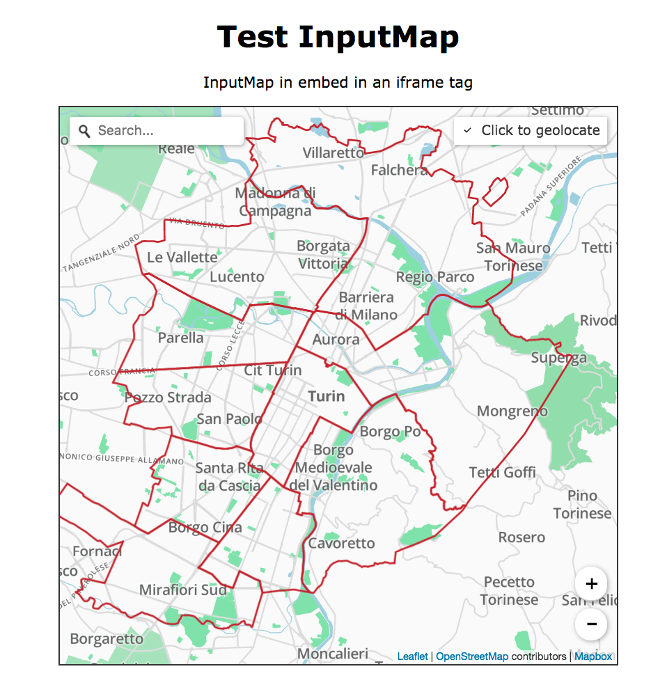

# InputMap

##### Change logs
1) Language support: introduced lang param and check on agent language as default
2) Label box with tooltip and location name
3) Cancel action to reset the current location
4) Material-like style
5) Search bar connected to Nominatim search API
6) Nominatim reverce geocoding of user's input in the result message when available: "address" and "display_name".


## Introduction

Web map to input enhanced location in web applications and websites.
InputMap uses leafletjs 1.x and vectorGrid plugin to provide an interactive layer of relevant area.

InputMap is meant to be used in an iframe tag, it can be controlled via params:

```
<iframe title="input a location" width="600" height="600" src="src/index.html?contrast=true&domain=http://www.yoursite.com&lat=45.070312&lon=7.686856&zoom=12"></iframe>
```

InputMap returns an object to the hosting window extending the latitude and longitude params from the leaflet "click" event.

[](http://inputmap.fldev.di.unito.it)

You can find this test page for InputMap at [https://inputmap.firstlife.org/test](https://inputmap.firstlife.org/test)


Example of object returned to the host window:
```
{
    id : 4524,
    lat : 45.07228938103685,
    zoom_level : 18,
    lng : 7.684319615364076,
    name : "site"
    osm_id : -9534,
    type : "site",
    level : 16
}
```

The information provided by InputMap are being dynamically retrieved from the tile server [tileArea](http://tiles.firstlife.org), specifically build for this purpose.

TileArea service provides [vector tiles](https://github.com/mapbox/vector-tile-spec) in [protobuf format (pbf)](https://developers.google.com/protocol-buffers/docs/encoding)


## Setup
The setup in your web application requires an iframe tag pointing to:

 1. dev enviroment [inputmap.fldev.di.unito.it/src](http://tiles.fldev.di.unito.it/src)
 2. production enviroment [inputmap.firstlife.org](https://inputmap.firstlife.org)

InputMap can be configured with several params, the only *mandatory param* is the domain *<your_domain>* of your current web application.
This params enable the communication between InputMap and your web application trough html 5 methods [Window.postMessage()](https://developer.mozilla.org/en-US/docs/Web/API/Window/postMessage).

```
<iframe title="input a location" width="600" height="600" src="<inputmap_url>?domain=<your_domain>&lat=<latitude>&lon=<longitude>&zoom=<zoom>"></iframe>
```

The optional params are:

1. lat: {float} initial latitude
2. lon: {float} initial longiture
3. zoom: {1-20} initial zoom level (1 is world level, 20 indoor level)
4. contrast: {true|false} enable high contrast map (default false)
5. lang: {[ISO 639-1 codes](https://en.wikipedia.org/wiki/List_of_ISO_639-1_codes)} language (default agent lang if defined or "en") 
6. mode: {lite | interactive} (default lite), in lite mode each click triggers a signal, in interactive mode the signal is sent only by clicking on the marker (to confirm the location)
7. state: {input|view|edit} (default entry)

***state*** param can be used to use input map in the following modalities:
  
  1. input (default): no markers pre inserted, user's actions will trigger input actions accordingly to mode param
  2. view: marker on lat lng position at the defined zoom level, the marker cannot be modified
  3. edit: marker at lat, lng and zoom that can be edited


## Use

InputMap accepts and returns spatial params in [EPSG:4326 format](http://spatialreference.org/ref/epsg/wgs-84/).


```
{
    id : <firstlife_id>,
    lat : <EPSG:4326 latitude>,
    lng : <EPSG:4326 longitude>,
    zoom_level : <zoom_level>,
    name : <feature_name>,
    osm_id : <OSM_id>,
    type : <feature_type>,
    level : <administrative_level>,
    src: 'InputMap',
    tileid: <x:y:z>,
    display_name: <string>,
    address: <Object>
}
```

Please note that src: 'InputMap' should be used to avoid to catch all window (dom) events.

1. id: {natural} feature id in FirstLife
2. lat: {float} input latitude
3. lon: {float} input longitude
4. zoom_level: {1-20} current zoom level
5. name: {string} if not applicable it is equivalent ot type
6. osm_id: {integer} osm id if applicable
7. type: {string} feature type if applicable (OSM tag)
8. level: {2-18} [OSM administrative level](http://wiki.openstreetmap.org/wiki/Tag:boundary%3Dadministrative), if applicable
9. tileid: {string} indicating the id of the clicked grid tile, it can be used in case of null <id>
10. tile: {array} [x,y,z] coordinates of the clicked tile
11. displa_name: {string} from Nominatim reverse geocoding service
12. address: {object} from Nominatim reverse geocoding service

To catch the message you require a listener over window events discriminating over the source of the message ('src' == 'InputMap'), see the following code:

```
 window.addEventListener( "message",
        function (e) {
            if (e.defaultPrevented)
                return
            e.preventDefault();

            if (e.origin !== iframeDomain) {
                return;
            }
            if(e.data.src == 'InputMap')
                doSomething(e.data);
        });
 ```
## Reset location
Users can cancel the current selection by click on a cancel button in the label box (top right corner). Cancel action triggers an empty message to the host application containing the "src" field only:
``` 
{
    "src": "InputMap"
}
```

## Notes
To use InputMap there are no specific requirements, rather than the browser support to *postMessage()* method.

For more information please refer to the *Browser compatibility* section at [postMessage](https://developer.mozilla.org/en-US/docs/Web/API/Window/postMessage).

### Services
1. FirstLife APIs
2. Nominatim APIs

### Dependences
1. [Leaflet](https://github.com/Leaflet/Leaflet)
2. [VectorGrid](https://github.com/Leaflet/Leaflet.VectorGrid)
3. [Control.Geocoder](https://github.com/perliedman/leaflet-control-geocoder)

### Dev Dependences
1. [serve](https://www.npmjs.com/package/serve)


### Licence
MIT